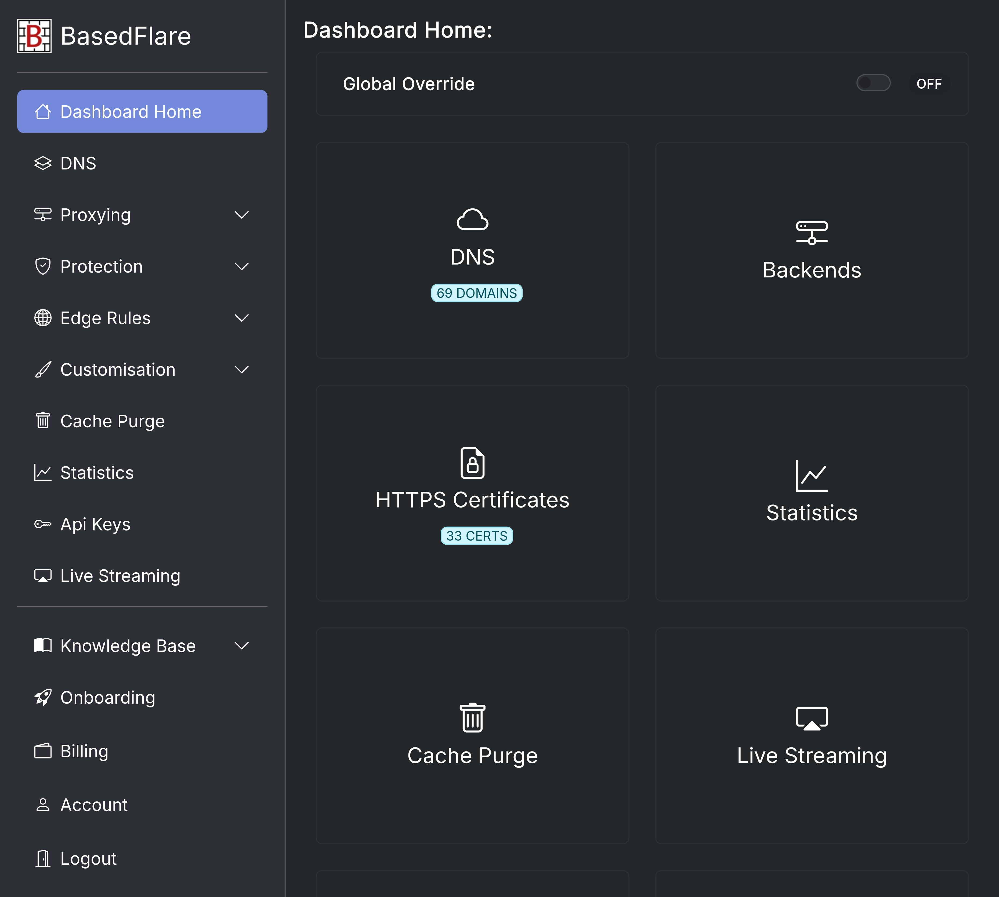

# BasedFlare Control Panel

Work in progress. Not recommended for production deployment. No instructions or help provided whatsoever.

Internally uses [haproxy dataplaneapi](https://github.com/haproxytech/dataplaneapi/).
Intended for use with [haproxy-protection](https://gitgud.io/fatchan/haproxy-protection).

Provides a control panel interface to conveniently manage clusters (groups of identically configured) HAProxy servers. Can be used with a single server cluster. Uses haproxy runtime apis to update maps, acls, etc.

##### Features:
- List/add/remove clusters (server groups).
- List/add/remove domains for your account.
- Control allowed hosts for a cluster.
- Custom backend server IP and port per-domain.
- Override to toggle proof-of-work for whole cluster.
- IP or subnet blacklist. Supports ipv4 and ipv6.
- IP or subnet whitelist. Supports ipv4 and ipv6.
- Protection rules, choose bot protection mode "none" (whitelist), proof-of-work or hCaptcha. Can be domain-wide or a domain+path. Path overrides domain-wide.
- Maintenance mode, disables proxying for selected domains and serves an "under maintenance" page from haproxy.
- Get https certificate for domains automatically from letsencrypt and upload to haproxy cluster.

##### Todo:
- Improved cert management
- Better Multi-user support
  - allow domain/cluster editing (with user dupe check) for non-admins
  - problems w/ ip whitelist and blacklist
- Some kind of payment system
- More advanced rules and ability to allow/block/bot mode based on those rules

#### Screenshots

## For generous people

Bitcoin (BTC): [`bc1q4elrlz5puak4m9xy3hfvmpempnpqpu95v8s9m6`](bitcoin:bc1q4elrlz5puak4m9xy3hfvmpempnpqpu95v8s9m6)

Monero (XMR): [`89J9DXPLUBr5HjNDNZTEo4WYMFTouSsGjUjBnUCCUxJGUirthnii4naZ8JafdnmhPe4NP1nkWsgcK82Uga7X515nNR1isuh`](monero:89J9DXPLUBr5HjNDNZTEo4WYMFTouSsGjUjBnUCCUxJGUirthnii4naZ8JafdnmhPe4NP1nkWsgcK82Uga7X515nNR1isuh)

Oxen (OXEN): `LBjExqjDKCFT6Tj198CfK8auAzBERJX1ogtcsjuKZ6AYWTFxwEADLgf2zZ8NHvWCa1UW7vrtY8DJmPYFpj3MEE69CryCvN6`
